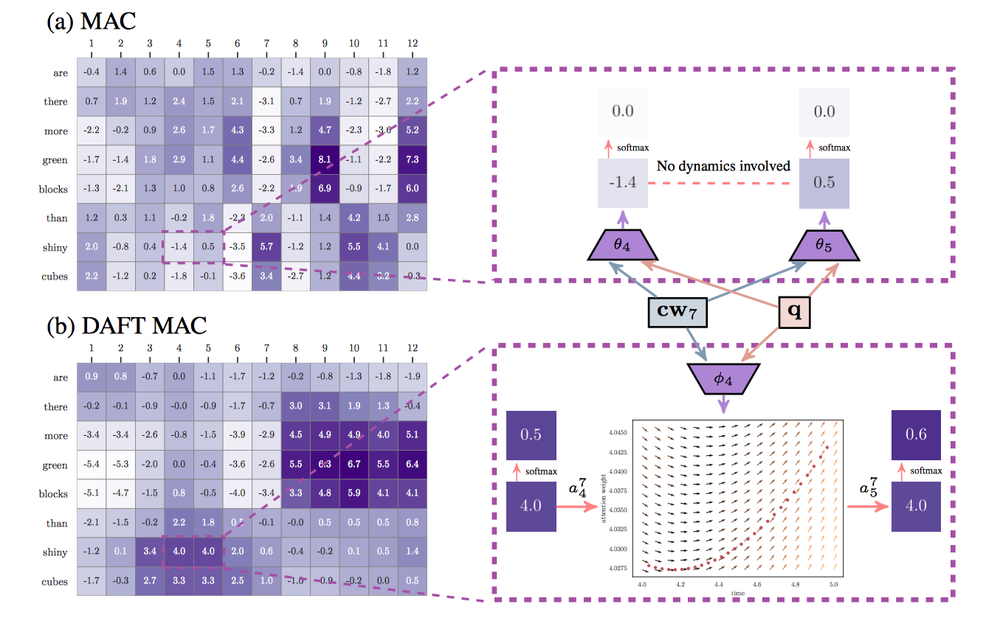

# DAFT
Code for the NeurIPS 2019 paper: "Learning Dynamics of Attention: Human Prior for Interpretable Machine Reasoning"

---
<p align="center">
  
</p>

## Dataset Preparation
For both CLEVR and GQA, we generally followed [Hudson et al](https://github.com/stanfordnlp/mac-network).
However, *pytorch* does not have thread-safe dataloader for hdf5 file.
So we split the hdf5 into single files for faster training and thread-safe data loading.
- CLEVR will space about 95GB after extraction (features 75GB, images 18GB, annots+misc <2GB).
- GQA will space about 140GB after extraction (features 115GB, images 21GB, annots+misc <4GB).

### CLEVR
1. Download CLEVR dataset (skip this step if you don't need visualization)
```
$ export DATASET_ROOT={Whatever you want}
$ cd $DATASET_ROOT
$ wget https://dl.fbaipublicfiles.com/clevr/CLEVR_v1.0.zip
$ unzip CLEVR_v1.0.zip
$ mv CLEVR_v1.0 clevr
```
2. Download preprocessed features and annotations  
(follow [[Hudson et al](https://github.com/stanfordnlp/mac-network)] if you want preprocess images and annotations for yourself)
```
$ cd $DATASET_ROOT/clevr
$ wget -O features.tar.gz https://www.dropbox.com/s/sis6lmrrx0ze3z1/features.tar.gz?dl=0
$ wget -O annots.tar.gz https://www.dropbox.com/s/5rto93ddayol949/annots.tar.gz?dl=0
$ tar -xvzf features.tar.gz
$ tar -xvzf annots.tar.gz
```

### GQA
1. Download GQA images (skip this step if you don't need visualization)
```
$ export DATASET_ROOT={Whatever you want}
$ cd $DATASET_ROOT
$ mkdir gqa
$ cd gqa
$ wget https://nlp.stanford.edu/data/gqa/images.zip
$ unzip images.zip
```
2. Download preprocessed features and annotations  
(follow instructions of [[Hudson et al](https://github.com/stanfordnlp/mac-network/tree/gqa)] if you want preprocess images and annotations for yourself)
```
$ cd $DATASET_ROOT/gqa
$ wget -O features.tar.gz https://www.dropbox.com/s/ag0te9o56pz30jk/features.tar.gz?dl=0
$ wget -O annots.tar.gz https://www.dropbox.com/s/t6bhts8g3xkslyu/annots.tar.gz?dl=0
$ tar -xvzf features.tar.gz
$ tar -xvzf annots.tar.gz
```

## Code
For reproducibility of our work, we employed experimentation framework [Sacred](https://github.com/IDSIA/sacred) and followed their [command-line interface](https://sacred.readthedocs.io/en/latest/command_line.html). 

### Requirements
- Python 3.6+ (for [f-string](https://www.python.org/dev/peps/pep-0498/))
- Pytorch 1.2.0+
- See `requirements.txt` for the rest.

### Training
- `$ python train.py with [dataset_name] root=[dataset_root] use_daft=[True|False] max_step=[step]`
- ex) `$ python train.py with clevr root=$DATASET_ROOT use_daft=True max_step=4`
- ex) `$ python train.py with gqa root=$DATASET_ROOT use_daft=False max_step=5`

For every epoch, model weights will be saved at `result/model/{daftmac|mac}_{clevr|gqa}_step{max_step}_{load_seed}`.

### Evaluation and Visualization
Put the model weight into `result/model/{daftmac|mac}_{clevr|gqa}_step{max_step}_{load_seed}` (e.g., `result/model/daftmac_gqa_step4_387678158/checkpoint_19.model`) and run

- Evaluation
  - `$ python evaluation.py with [dataset_name] root=[dataset_root] use_daft=[True|False] max_step=[step] load_seed=[seed]`
  - ex) `$ python evaluation.py with clevr root=$DATASET_ROOT use_daft=False max_step=2 load_seed=608494298`
  - ex) `$ python evaluation.py with gqa root=$DATASET_ROOT use_daft=True max_step=12 load_seed=305083948`

- Visualization
  - `$ python visualize.py with [dataset_name] root=[dataset_root] use_daft=[True|False] max_step=[step] load_seed=[seed]`
  - ex) `$ python visualize.py with clevr root=$DATASET_ROOT use_daft=False max_step=2 load_seed=608494298`
  - ex) `$ python visualize.py with gqa root=$DATASET_ROOT use_daft=True max_step=12 load_seed=305083948`

## Citation
If you use any part of this code for your research, please cite our [paper](https://arxiv.org/abs/1905.11666).
```
@inproceedings{kim2019learning,
  title={Learning Dynamics of Attention: Human Prior for Interpretable Machine Reasoning},
  author={Kim, Wonjae and Lee, Yoonho},
  booktitle={Advances in Neural Information Processing Systems (NeurIPS)},
  year={2019}
}
```

## Contact for Issues
- Wonjae Kim, dandelin.kim@kakaocorp.com
- Yoonho Lee, eddy.l@kakaocorp.com

## References & Opensources

1. MAC-Network
    - Paper : https://arxiv.org/abs/1803.03067
    - Author's Code : https://github.com/stanfordnlp/mac-network/tree/master
2. GQA
    - Paper : https://arxiv.org/abs/1902.09506
    - Author's Code : https://github.com/stanfordnlp/mac-network/tree/gqa
3. Neural ODE & ODE solvers
    - Paper : https://arxiv.org/abs/1806.07366
    - Author's Code : https://github.com/rtqichen/torchdiffeq

## License

This software is licensed under the [Apache 2 license](LICENSE), quoted below.

Copyright 2019 Kakao Corp. <http://www.kakaocorp.com>

Licensed under the Apache License, Version 2.0 (the "License"); you may not
use this project except in compliance with the License. You may obtain a copy
of the License at http://www.apache.org/licenses/LICENSE-2.0.

Unless required by applicable law or agreed to in writing, software
distributed under the License is distributed on an "AS IS" BASIS, WITHOUT
WARRANTIES OR CONDITIONS OF ANY KIND, either express or implied. See the
License for the specific language governing permissions and limitations under
the License.